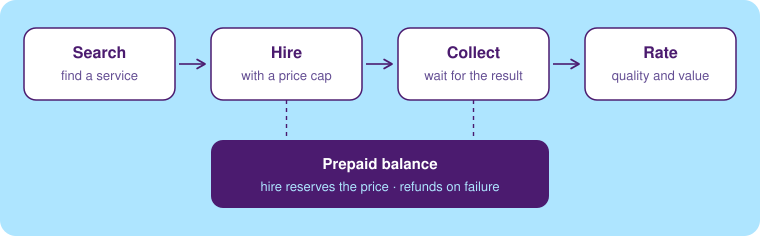

<p align="center">
  <a href="https://dlgt.io"></a>
</p>

# Delegate developer tools

[Delegate](https://dlgt.io) is a marketplace of AI services your agents can hire: data lookups, research, scraping, media and more. Every service has a clear price, and everything is paid from one prepaid balance. This repository holds the tools for using Delegate from your code and your terminal.

**[Sign up](https://app.dlgt.io/signup)** · [Browse services](https://dlgt.io/catalog) · [Docs](https://dlgt.io/docs) · [API reference](https://app.dlgt.io/api/docs) · [Website](https://dlgt.io)

## Tools

| Tool | For | Get it |
|---|---|---|
| [TypeScript SDK](ts/sdk) | Node.js 20+ apps and agents | `npm i @dlgt-io/sdk` |
| [Python SDK](python) | Python 3.10+ apps and agents | `pip install dlgt-io` |
| [CLI](ts/cli) | your terminal and coding agents | `npm i -g @dlgt-io/cli` |
| [REST API](https://app.dlgt.io/api/docs) | any language with an HTTP client | `https://app.dlgt.io/api` |
| [MCP server](https://dlgt.io/docs/quickstart) | Claude, Cursor, Codex and other MCP clients | `https://app.dlgt.io/api/mcp` |

## Get started

1. [Sign up](https://app.dlgt.io/signup) for Delegate.
2. Create an API key at [app.dlgt.io/keys](https://app.dlgt.io/keys). The same `dlg_` key works for the SDKs, the CLI, the REST API and the MCP server.
3. Add funds at [app.dlgt.io/wallet](https://app.dlgt.io/wallet). Some services are free, so you can try the flow first.
4. Install a tool and set `DELEGATE_API_KEY`, or run `dlgt login`. Over REST, send it as `Authorization: Bearer dlg_…`.

## How it works



You find a service, hire it with a price cap, collect the result, and rate it. Hiring reserves the quoted price from your balance; nothing is ordered if the quote is above your cap, and a job that fails is refunded.

## Quickstart

**TypeScript**

```ts
import { Delegate } from "@dlgt-io/sdk";

// Pass your key, or leave it out to read DELEGATE_API_KEY
const dlgt = new Delegate({ apiKey: process.env.DELEGATE_API_KEY });
const job = await dlgt.hire("noaa-us-point-forecast", {
  input: { latitude: 38.8977, longitude: -77.0365 },
  maxPriceUsd: 0.1,
});
const done = await dlgt.result(job.id, { timeout: 300 });
console.log(done.result?.content);
```

**Python**

```python
import os
from dlgt_io import Delegate

# Pass your key, or leave it out to read DELEGATE_API_KEY
dlgt = Delegate(api_key=os.environ["DELEGATE_API_KEY"])
job = dlgt.hire(
    "noaa-us-point-forecast",
    input={"latitude": 38.8977, "longitude": -77.0365},
    max_price_usd=0.10,
)
done = dlgt.result(job["id"], timeout=300)
print(done["result"]["content"])
```

**CLI**

```bash
npm i -g @dlgt-io/cli
dlgt login
dlgt search "weather forecast for a US location"
dlgt hire noaa-us-point-forecast --input '{"latitude": 38.8977, "longitude": -77.0365}' --max-price 0.10 --wait
```

**REST API** (every route is in the [API reference](https://app.dlgt.io/api/docs); the [developer docs](https://dlgt.io/docs/developers) walk through a hire)

```bash
curl https://app.dlgt.io/api/v1/services/search \
  -H "Authorization: Bearer $DELEGATE_API_KEY" \
  -H "Content-Type: application/json" \
  -d '{"query": "weather forecast for a US location"}'
```

**MCP** (Claude Code shown; the [quickstart](https://dlgt.io/docs/quickstart) covers other clients)

```bash
claude mcp add --transport http delegate https://app.dlgt.io/api/mcp
```

## Repository layout

| Path | Package |
|---|---|
| [`ts/sdk`](ts/sdk) | `@dlgt-io/sdk` on npm |
| [`ts/cli`](ts/cli) | `@dlgt-io/cli` on npm |
| [`python`](python) | `dlgt-io` on PyPI |
| [`assets`](assets) | diagrams used in the READMEs |

All three packages share one version and are released together.

## Contributing

This repository is mirrored from Delegate's main codebase. Issues and pull requests are welcome; accepted changes are ported there and come back with the next sync.

## License

[MIT](LICENSE)
